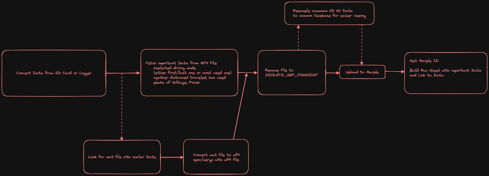

# DataProcessing ToolChain

## TODO

implement converter in C++ or smth to make it faster. python is slow as fuck! Hias was always right!

## Structure:

`DataProcessing.py` Launch Script in CLI

`converter.py` houses main canlib converter function + listfiles operation

`checkdbcfiles.py` Checks if DBC Git submodule is up to date

`marple_api.py` Uploads all files in results folder to appropiate Marple Folder

`testconverter.py` Test File for Converter

## Usage:

    python DataProcessing.py

Choose Log Files to convert, converted files are then uploaded to Marple.

## Demo

## Basic Idea for full Toolchain:

## Install

Install Python Requirements:

    pip install -r requirements.txt

requirements.txt is created using pipreqs or pip freeze > requirements.txt

## Marple API Key

For Marple Stuff .env File is needed with API Key!

    SECRET_ACCESS_TOKEN = "Key goes here"

# Docs

Kvaser CANlib SDK: https://kvaser.com/developer/canlib-sdk/

canlib - a Python wrapper for Kvaser CANlib: https://pycanlib.readthedocs.io

Marple API: https://docs.marpledata.com/docs/for-developers/python

Marple Python: https://pypi.org/project/marpledata/

Cooles dings: https://github.com/emotionrennteam/log-storage-client

https://git-scm.com/book/en/v2/Git-Tools-Submodules